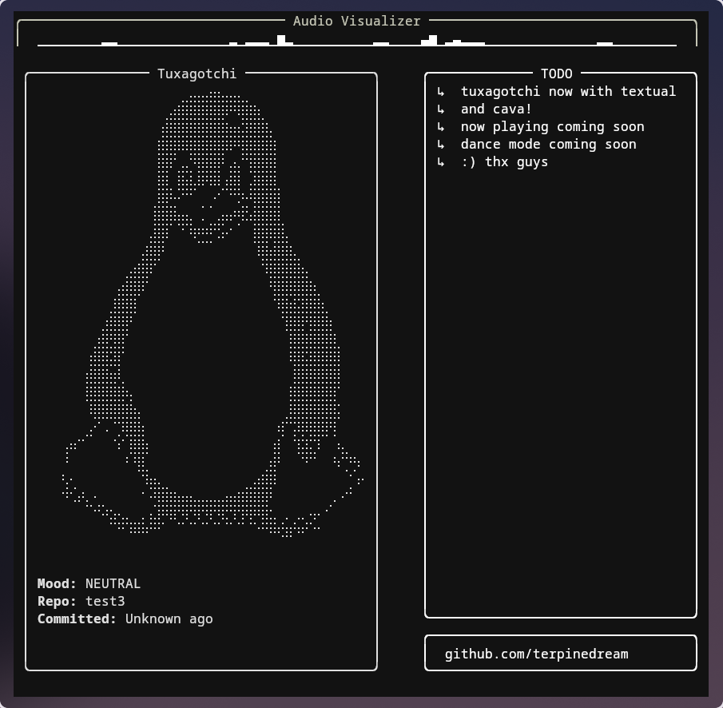

# Tuxagotchi (Textual Edition)

Tuxagotchi is a terminal-based companion that thrives on your GitHub activity.  
This version is a complete refactor using [Textual](https://textual.textualize.io/), offering a dynamic terminal UI that includes commit tracking, a live-updating Tux avatar, a todo list, and now an **audio visualizer powered by [Cava](https://github.com/karlstav/cava)**.



---

## Features

-  ASCII-rendered Tux that reacts to your GitHub commit history  
-  Countdown timer showing when Tux will get hungry  
-  Interactive TODO list  
-  Terminal-based audio visualizer (via Cava)  
-  Responsive UI for tiling window managers  
-  Built using the [Textual](https://textual.textualize.io/) framework

---

## Installation

1. **Clone the repository:**
   ```bash
   git clone https://github.com/terpinedream/tuxagotchi.git
   cd tuxagotchi
   ```

2. **Install Python dependencies:**
   ```bash
   pip install -r requirements.txt
   ```

3.**Install external dependencies:**

   - **Cava** is required for the audio visualizer:
     - Arch Linux:
       ```bash
       sudo pacman -S cava
       ```
     - Debian/Ubuntu:
       ```bash
       sudo apt install cava
       ```
     - Or [build from source](https://github.com/karlstav/cava#installation)

4. **Create a `config.json` file** in the root directory with the following structure:
   ```json
   {
     "github": {
       "username": "your-github-username",
       "repo": "your-repo-name"
     }
   }
   ```

---

## Running the Application

```bash
python3 -m textual_app.app
```

---

## Author

Maintained by [@terpinedream](https://github.com/terpinedream)
