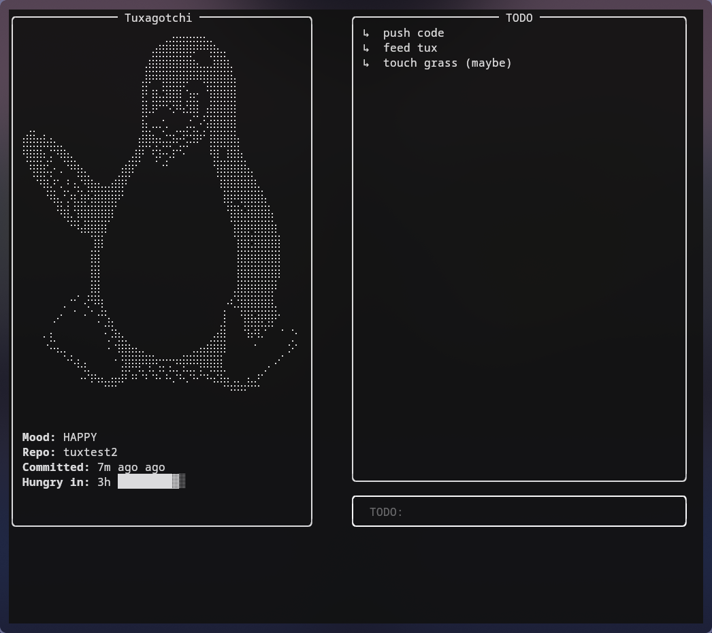

# Tuxagotchi (Textual Edition)

Tuxagotchi is a terminal-based companion that thrives on your GitHub activity.  
This version is a complete refactor using [Textual](https://textual.textualize.io/), offering a dynamic terminal UI that includes commit tracking, a live-updating Tux avatar, and a todo list.



---

## Features

- ASCII-rendered Tux that reacts to your GitHub commit history
- Countdown timer showing when Tux will get hungry
- Built-in interactive TODO list
- Responsive UI for tiling window managers
- Built using the Textual framework

---

## Installation

1. Clone the repository:
   ```bash
   git clone https://github.com/terpinedream/tuxagotchi.git
   cd tuxagotchi
   ```

2. Install dependencies:
   ```bash
   pip install -r requirements.txt
   ```

3. Create a `config.json` file in the root directory with the following structure:
   ```json
   {
     "github": {
       "username": "your-github-username",
       "repo": "your-repo-name"
     }
   }
   ```

---

## Running the Application

```bash
python3 -m textual_app.app
```

---

## Author

Maintained by [@terpinedream](https://github.com/terpinedream)
